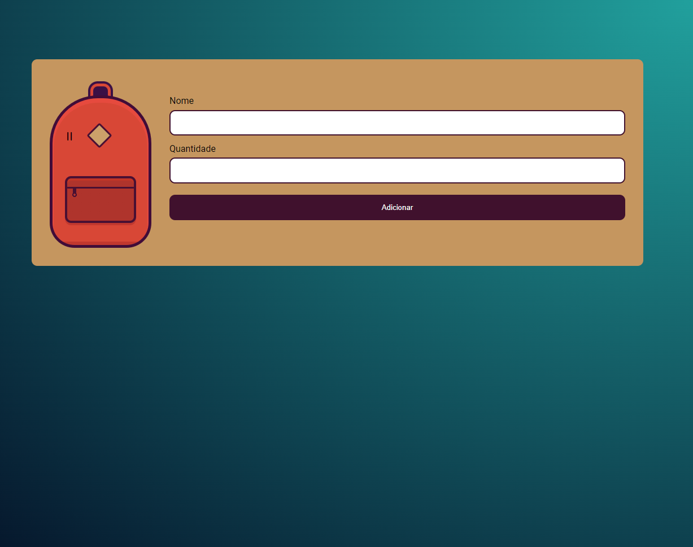

# <h1 align="center">Site de Mochila de Viagem</h1>

<h2 align="center"> Descrição do Projeto </h2>
 

    Criação do site de Mochila de viagem, no qual você insere o nome do objeto que vai colocar na mala e a quantidade. 
     
    Projeto desenvolvido para demonstrar os conhecimentos adquiridos no curso "JavaScript na Web: armazenando dados no navegador", presente no site na Alura.

 

<h2 align="center"> :hammer:  Ferramentas e Funcionalidades  :hammer: </h2>
 

      

 

Ao salvar os dados lançados nos campos correspondentes, eles são armazenados dinamicamente na página, sendo possível modificá-las. 

 
          
<h2 align="center"> :notebook:  O que Aprendi  :notebook:</h2>

 - Interagir com a página e com LocalStorage;
 - Criar objetos no JavaScript;
 - Registrar dados no LocalStorage;
 - Implementar páginas que armazenam dados;
 
 
 
<h2 align="center"> :heart:  Contato  :heart:</h2>
 

regothardo@gmail.com
